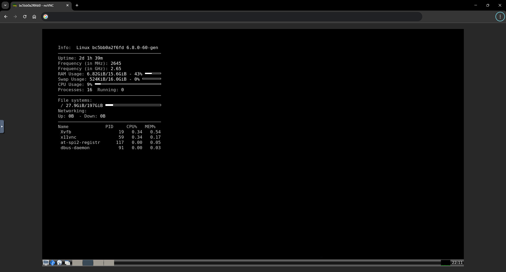

# Docker-SlimVNC
    
## Overview
A Dockerized desktop environment featuring Openbox, LXPanel, and Conky for a lightweight, efficient setup. It includes Google Chrome with adjusted flags, a VNC server for remote access, and noVNC for web-based control, offering a functional virtual workspace optimized for performance and usability.

## Features
- **Minimal Debian-based desktop environment**
- **Integrated Google Chrome with sandboxing adjustments**
- **VNC server for remote access**
- **Web-based VNC via noVNC**
- **System monitoring with Conky**
- **Optimized usability within containerized setups**

## Run
```

docker volume create docker-slimvnc-google-chrome

# Option:1
docker run -d --name docker-slimvnc \
  -e VNC_PASS="your_secure_password" \
  -p 5901:5901 -p 6080:6080 \
  -v docker-slimvnc-google-chrome:/root/.config/google-chrome \
  --shm-size=2gb \
  ghcr.io/techroy23/docker-slimvnc:latest

# Option:2
docker run -d --name docker-slimvnc \
  -e VNC_PASS="your_secure_password" \
  -e VNC_PORT=5555 \
  -e NOVNC_PORT=6666 \
  -p 5555:5555 -p 6666:6666 \
  -v docker-slimvnc-google-chrome:/root/.config/google-chrome \
  --shm-size=2gb \
  ghcr.io/techroy23/docker-slimvnc:latest

```

## Access
- VNC Client: localhost:5901
- Web Interface (noVNC): http://localhost:6080

## Explore these subprojects for additional functionality and integrations:
Check them out for complementary tools and features!
- **[Techroy23-Docker-Wipter](https://github.com/techroy23/Docker-Wipter)** - [Wipter Website](https://wipter.com/register?via=66075F1E60)
- **[Techroy23-Docker-Peer2Profit](https://github.com/techroy23/Docker-Peer2Profit)** - [Peer2Profit Telegram](https://t.me/peer2profit_app_bot?start=1628962882611800423c343)
- **[Techroy23-Docker-UrNetwork](https://github.com/techroy23/Docker-UrNetwork)** - [UrNetwork Website](https://ur.io/c?bonus=0MYG84)


## Screenshot

